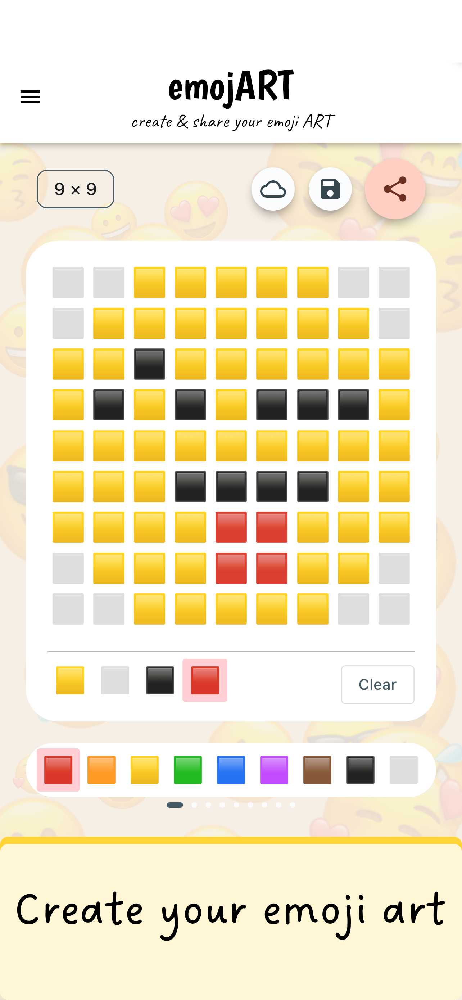
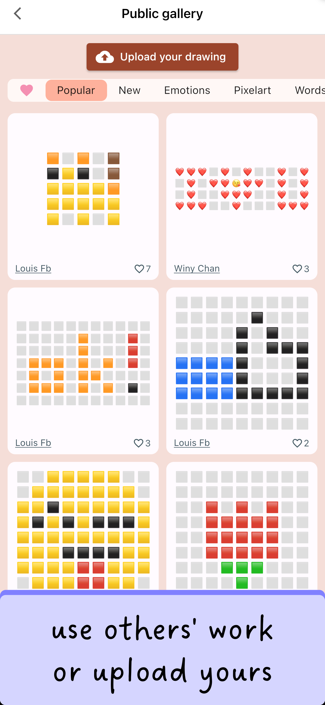
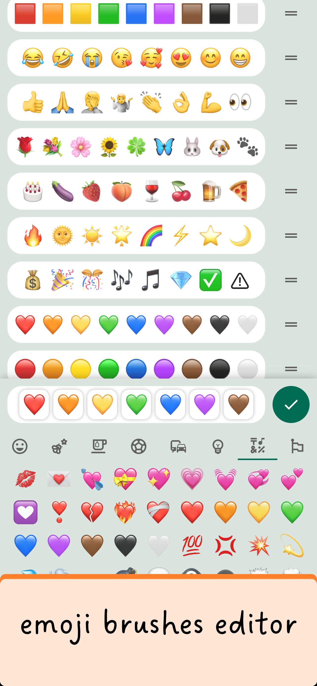

# The emojART flutter app

This app was recently published on the [App store](https://apps.apple.com/us/app/emojart/id1632243774) and the [Play store](https://play.google.com/store/apps/details?id=com.navonapps.emojart). You are welcome to [download](https://navonapps.github.io/emojart/download_app.htm) it and take a look. I hope you will like it!

[Download the emojART app](https://navonapps.github.io/emojart/download_app.htm)

So basically, this app helps you create pixel art with emojis, a.k.a. emoji art. With this app, you can create emoji art by drawing on a mobile device with emojis as brushes. You can then copy and paste it on social media such as Facebook or Whatsapp.

&nbsp;&nbsp; &nbsp;&nbsp;  

The app contains features such as saving, uploading, sharing, and downloading emoji art. Users can save and like other people's artifacts. There is also a feature to choose the set of emojis to use as brushes. I used Google's [Firebase](https://firebase.google.com/) as the authentication platform, supporting Facebook, Google, and Apple ID login, and the database backend, to handle users uploading and downloading their artworks. I used UI elements such as drag-and-drop and layers to allow users to edit and rearrange the brush bars.

[Download the emojART app](https://navonapps.github.io/emojart/download_app.htm)

I am sorry that the source code of the app is not available here. If potential employers want to see my code to assess my programming skills, you can contact me at louiskhchan@outlook.com.

