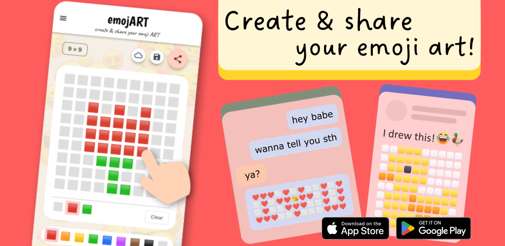

# The emojART flutter app

This app was recently published on the [App store](https://apps.apple.com/us/app/emojart/id1632243774) and the [Play store](https://play.google.com/store/apps/details?id=com.navonapps.emojart). You are welcome to [download](https://navonapps.github.io/emojart/download_app.htm) it and take a look. I hope you will like it!

[Download the emojART app](https://navonapps.github.io/emojart/download_app.htm)

So basically, this app helps you create pixel art with emojis, a.k.a. emoji art. With this app, you can create emoji art by drawing on a mobile device with emojis as brushes. You can then copy and paste it on social media such as Facebook or Whatsapp.

The app contains features such as saving, uploading, sharing, and downloading emoji art. Users can also save and like other people's artifacts. I used Google's [Firebase](https://firebase.google.com/) as the authentication and cloud database backend, supporting Facebook, Google, and Apple ID login. Users can make an in-app purchase or subscribe to an ads-free premium version of the app. I used the [RevenueCat](https://www.revenuecat.com/) SDK as the payment backend.

I am sorry that I cannot share my code here. If potential employers want to see the code to assess my programming skills, you can contact me at louiskhchan@outlook.com.

